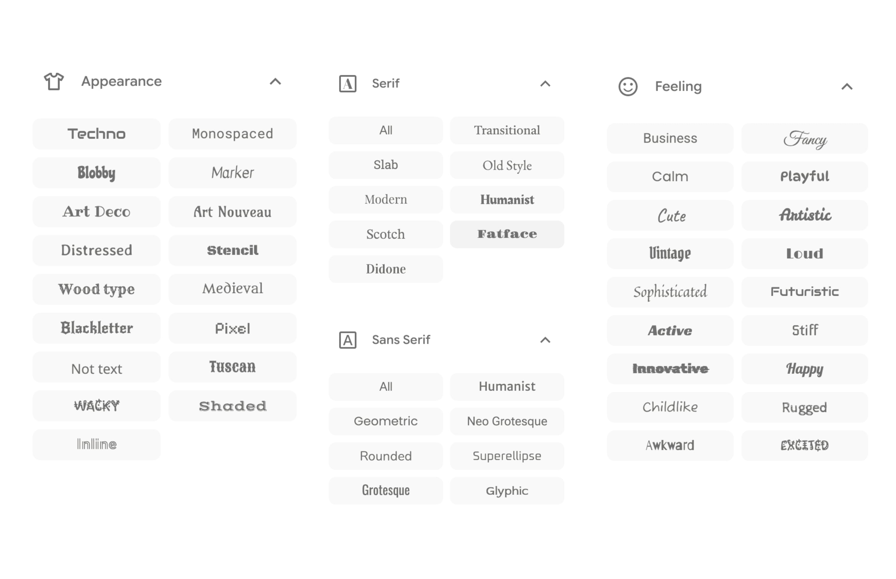

## Objectives

::: {.incremental}
- Know what an SCSS file is and how to use it
- Set fonts, colors, and sizes with sass variables
- Know when to drop down to CSS rules
:::

## The 10 Minute Theme

You can get very far with theming using only

- fonts
- colors
- sizes

::: footer
<https://slidecrafting-book.com/10-minute>
:::

# How do we specify the theme?

## Themes are written with CSS

> Cascading Style Sheets (CSS) is a stylesheet language used to describe the presentation of a document written in HTML

CSS is written as a series of pairs; **selectors** and **properties**.

- selectors specify what elements on a page we want to style.

- properties specify what the elements should look like.

## One rule

::: {.codewindow .codewindow-dark .css width="70%"}
styles.css

```css
.reveal .slide a {
  color: #219ea7;
  text-decoration: underline;
}
```
:::

`.reveal .slide a` is the selector. It picks out the links on your slides.

`color` and `text-decoration` are the properties. They say what those links look like.

## Why so many words on the left?

::: {.codewindow .codewindow-dark .css width="70%"}
styles.css

```css
a {
  text-decoration: underline;
}
```
:::

This does nothing. Reveal already has its own rule for links, and it is more specific than yours.

`.reveal .slide` in front is how you out-specify it. Expect that prefix on most rules you write.

::: footer
<https://slidecrafting-book.com/scss>
:::

## A language that compiles to CSS

While CSS is very powerful, it can also feel a little too wordy and less expressive.
So we use the compiled langauge Sass.

::: {.incremental}
- You write Sass
- A compiler turns it into plain CSS
- The browser gets the CSS
:::

::: {.fragment}
Quarto runs that compiler for you on every render. There is no build step to set up.
:::

## Sass has two syntaxes

:::::: {.columns}

::::: {.column width="50%"}

:::: {.codewindow .codewindow-dark .sass}
styles.sass

```sass
.reveal .slide
  ul
    line-height: 1.4
```
::::

:::::

::::: {.column width="50%"}

:::: {.codewindow .codewindow-dark .scss}
styles.scss

```scss
.reveal .slide {
  ul {
    line-height: 1.4;
  }
}
```
::::

:::::

::::::

Same language, same features. SCSS is the one that looks like CSS, and the one everybody uses.

## So, names

::: {.incremental}
- **Sass** the language and the compiler
- **SCSS** the syntax you write it in, and the file extension
- **CSS** what comes out the other end
:::

::: {.fragment}
Quarto expects `.scss`. That is the only one you need to think about.
:::

# Why SCSS?

## One value, one place

:::::: {.columns}

::::: {.column width="50%"}

:::: {.codewindow .codewindow-dark .scss}
styles.scss

```scss
$theme-blue: #219ea7;

.blue {
  color: $theme-blue; 
}

.reveal .slide a {
  color: $theme-blue;
  }

.reveal .progress {
  background: $theme-blue;
}
```
::::

:::::

::::: {.column width="50%"}

:::: {.codewindow .codewindow-dark .css}
styles.css

```css
.blue {
  color: #219ea7;
}

.reveal .slide a {
  color: #219ea7;
}

.reveal .progress {
  background: #219ea7;
}
```
::::

:::::

::::::

## The compiler writes the boring parts

:::::: {.columns}

::::: {.column width="50%"}

:::: {.codewindow .codewindow-dark .scss}
styles.scss

```scss
$colors: (
  "red": #FA5F5C,
  "blue": #394D85,
  "yellow": #FFF7C7
);

@each $name, $color in $colors {
  .text-#{$name} {
    color: $color; 
  }
  .bg-#{$name} {
    background-color: $color;
  }
}
```
::::

:::::

::::: {.column width="50%"}

:::: {.codewindow .codewindow-dark .css}
styles.css

```css
.text-red {
  color: #FA5F5C;
}
.bg-red {
  background-color: #FA5F5C;
}

.text-blue {
  color: #394D85;
}
.bg-blue {
  background-color: #394D85;
}

.text-yellow {
  color: #FFF7C7;
}
.bg-yellow {
  background-color: #FFF7C7;
}
```
::::

:::::

::::::

::: footer
<https://slidecrafting-book.com/scss>
:::

## Write the awkward prefix once

Reveal's own styles are specific, so your rules need `.reveal .slide` in front to win.

:::::: {.columns}

::::: {.column width="50%"}

:::: {.codewindow .codewindow-dark .scss}
styles.scss

```scss
.reveal .slide {
  ul {
    line-height: 1.4;
  }

  a {
    text-decoration: underline;
    &:hover {
      text-decoration: none;
    }
  }
}
```
::::

:::::

::::: {.column width="50%"}

:::: {.codewindow .codewindow-dark .css}
styles.css

```css
.reveal .slide ul {
  line-height: 1.4;
}

.reveal .slide a {
  text-decoration: underline;
}

.reveal .slide a:hover {
  text-decoration: none;
}
```
::::

:::::

::::::

## Mistakes get caught

A typo in CSS is silent. The browser drops the line and moves on.

::: {.incremental}
- `$primry-color` fails to compile and tells you the line
- Undefined mixins and functions do the same
- You find out at render time, not from the back row
:::

## The theme outlives the talk

You are not styling one deck. You are building a look you keep.

::: {.incremental}
- Next talk starts by copying one file
- Fix something once and every future deck has it fixed
- Variables at the top are the knobs you actually turn
:::

::: {.fragment}
That is the whole bet: pay the setup cost once, spend the rest of your time on content.
:::

# Setup

## One line of YAML, one file

<!-- TODO: code/result pair, unthemed deck -->

::: {.codewindow .codewindow-dark .quarto width="70%"}
my-deck.qmd

```yaml
format:
  revealjs:
    theme: [default, styles.scss]
```
:::

Combine a built-in theme with your sheet, or skip the built-in with `theme: styles.scss`.

::: footer
<https://quarto.org/docs/presentations/revealjs/themes.html>
:::

## The two layers

::: {.codewindow .codewindow-dark .sass width="70%"}
styles.scss

```scss
/*-- scss:defaults --*/

/*-- scss:rules --*/
```
:::

::: {.incremental}
- `defaults` sass variables, read before Quarto builds the theme
- `rules` plain CSS, applied after
:::

::: {.fragment}
Reach for a variable first. Write a rule only when no variable exists.
:::

<!-- TODO: mention scss:mixins / scss:functions exist, one line, no slide of its own? -->

# Fonts

## Three variables

::: {.incremental}
- `$presentation-heading-font` slide titles
- `$font-family-sans-serif` body text
- `$font-family-monospace` inline code and code blocks
:::

## Where to find a good font?

{fig-align="center"}

::: footer
<https://fonts.google.com/>
:::

## Getting the font in

<https://fonts.google.com>

::: {.incremental}
1. Pick a font
2. Select the styles you want
3. "Get embed code"
4. Copy the `@import` version, not the `<link>` version
:::

::: footer
<https://fonts.google.com/>
:::

## Getting the font in

:::: {.stage}

::: {.codewindow .codewindow-dark .scss .fragment .stage-exit data-fragment-index="1"}
styles.scss

```scss
/*-- scss:defaults --*/
@import url('https://fonts.googleapis.com/css2?family=Josefin+Sans&family=Lato&family=Space+Mono&display=swap');

$presentation-heading-font: "Josefin Sans", sans-serif;
$font-family-sans-serif: "Lato", sans-serif;
$font-family-monospace: "Space Mono", monospace;
```
:::

::: {.fragment .stage-enter data-fragment-index="1"}
<iframe src="examples/fonts.html#/a-slide-in-the-making" title="A deck rendered with those three fonts"></iframe>
:::

::::

## Tips for finding good fonts

Seeing what other people are doing

Looking up [font pairings](https://www.google.com/search?q=font+pairings&sourceid=chrome&source=chrome.ob&ie=UTF-8) online

Lots of trial and error

Default fonts are fine too!

# Colors

## Five variables

::: {.incremental}
- `$body-bg` slide background
- `$body-color` body text
- `$presentation-heading-color` titles
- `$link-color` links, progress bar, menu
- `$code-color` inline code
:::

## A dark theme in five lines

:::: {.stage}

::: {.codewindow .codewindow-dark .scss .fragment .stage-exit data-fragment-index="1"}
styles.scss

```scss
/*-- scss:defaults --*/
// ...

$body-bg: #1C1C2B;
$body-color: #bac2de;
$presentation-heading-color: #cba6f7;
$link-color: #fab387;
$code-color: #89b4fa;
```
:::

::: {.fragment .stage-enter data-fragment-index="1"}
<iframe src="examples/dark.html#/a-slide-in-the-making" title="The same deck, now with colors as well as fonts"></iframe>
:::

::::

## Contrast is not optional

<iframe class="toolframe" src="https://colourcontrast.cc/" title="colourcontrast.cc, a contrast checker"></iframe>

::: footer
<https://colourcontrast.cc>
:::

## Where to get your colors

::: {.incremental}
- Brand guidelines
- Color palettes
- Pulling from images
- Pinterest
:::

## The code highlighter is separate

`highlight-style` controls code blocks, and it does not follow your `$body-bg`.

<!-- TODO: dark theme + light highlighter screenshot as the failure case -->

# Sizes

## Six variables, you need three

::: {.incremental}
- `$presentation-font-size-root` everything scales off this
- `$presentation-h1-font-size` / `$presentation-h2-font-size`
- `$code-block-font-size`
:::

## New sizes

:::: {.stage}

::: {.codewindow .codewindow-dark .scss .fragment .stage-exit data-fragment-index="1"}
styles.scss

```scss
/*-- scss:defaults --*/
// ...

$presentation-font-size-root: 40px;
$presentation-h1-font-size: 80px;
$presentation-h2-font-size: 60px;
$code-block-font-size: 0.9em;
```
:::

::: {.fragment .stage-enter data-fragment-index="1"}
<iframe src="examples/sizes.html#/a-slide-in-the-making" title="The finished theme: fonts, colors, and sizes"></iframe>
:::

::::

::: footer
<https://slidecrafting-book.com/sizes>
:::

# When variables run out

## quarto revealjs sass variables

you can go really far with the revealjs sass variables

however it doesn't cover everything possible that we could want to do

so we will need to write our own SCSS rules

::: footer
<https://quarto.org/docs/presentations/revealjs/themes.html#sass-variables>
:::

## Demo: which class do I hit?

> If you can see it on a slide, it has a selector. The browser will tell you what it is.

::: {.incremental}
1. Right-click the thing you want to style, pick "Inspect"
2. Read the HTML pane: the element and the classes it carries
3. Read the styles pane: the rules already hitting it, most specific first
4. Edit a value right there to check you picked the right one
5. Then write that selector into `styles.scss`
:::

::: {.fragment}
Nothing you change in the inspector is saved. It is a scratchpad, not an editor.
:::

## Write a rule

<!-- TODO: a small, obviously useful rule. Tighten list spacing? Style the footer? -->

::: {.codewindow .codewindow-dark .sass width="70%"}
styles.scss

```scss
/*-- scss:rules --*/
.reveal .slide ul {
  line-height: 1.4;
}
```
:::

Changing the line height of a unordered list

## Your own classes

Define a class once, use it on any slide or span.

:::: {.stage}

::: {.codewindow .codewindow-dark .scss .fragment .stage-exit data-fragment-index="1"}
styles.scss

```scss
/*-- scss:rules --*/
.reveal .slide .highlight {
  background-color: #fab387;
  color: #1C1C2B;
  padding: 0 0.2em;
  border-radius: 4px;
}
```
:::

::: {.fragment .stage-enter data-fragment-index="1"}
<iframe src="examples/classes.html#/a-slide-in-the-making" title="A span picked out with a custom highlight class"></iframe>
:::

::::

::: {.fragment}
`The [important part]{.highlight} of the sentence.`
:::

## Slide variants

Same deck, a handful of slide looks. Give a slide a class and style that class.

::: {.codewindow .codewindow-dark .quarto width="70%"}
my-deck.qmd

```markdown
## A normal slide

## A section break {.variant-one}

## An exercise {.variant-two}
```
:::

::: {.fragment}
The plain slide is your base style. A class is what you reach for when you want a different one.
:::

::: footer
<https://slidecrafting-book.com/theme>
:::

## One block per variant

::: {.codewindow .codewindow-dark .sass width="70%"}
styles.scss

```scss
/*-- scss:rules --*/
.variant-one {
  background-color: #1C1C2B;
  color: #d6d6d6;

  h1, h2 {
    color: #f3f3f3;
  }

  a {
    color: #00e0e0;
  }
}
```
:::

::: {.fragment}
Nesting keeps a variant in one readable block, so adding a second is copy, rename, change the colors.
:::

::: footer
<https://slidecrafting-book.com/theme>
:::

## What variants are good for

::: {.incremental}
- Section breaks, so the deck visibly changes gear
- Functional slides: exercises, demos, results
- Marking the parts of an argument: problem, solution
:::

::: {.fragment}
The classic is xaringan's `inverse`: one dark slide among the white ones, used for a section break or a quote.
:::

::: footer
<https://slidecrafting-book.com/theme>
:::

# Your turn

## Exercise

::: {.incremental}
1. Add `styles.scss` to the preview deck and wire up `theme:`
2. Pick two Google Fonts, one for headings, one for body
3. Set the 2 color variables, then check the contrast
4. Bump `$presentation-font-size-root` until it feels too big, then leave it there
:::

# Thank you

Back to the [workshop materials](../materials/02-theming.qmd).
