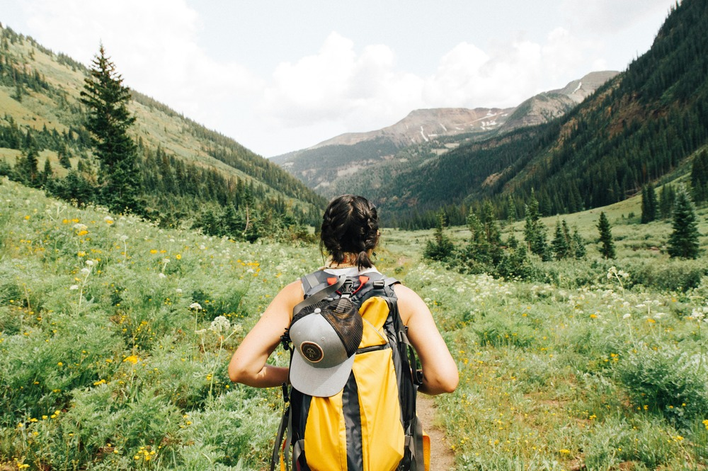
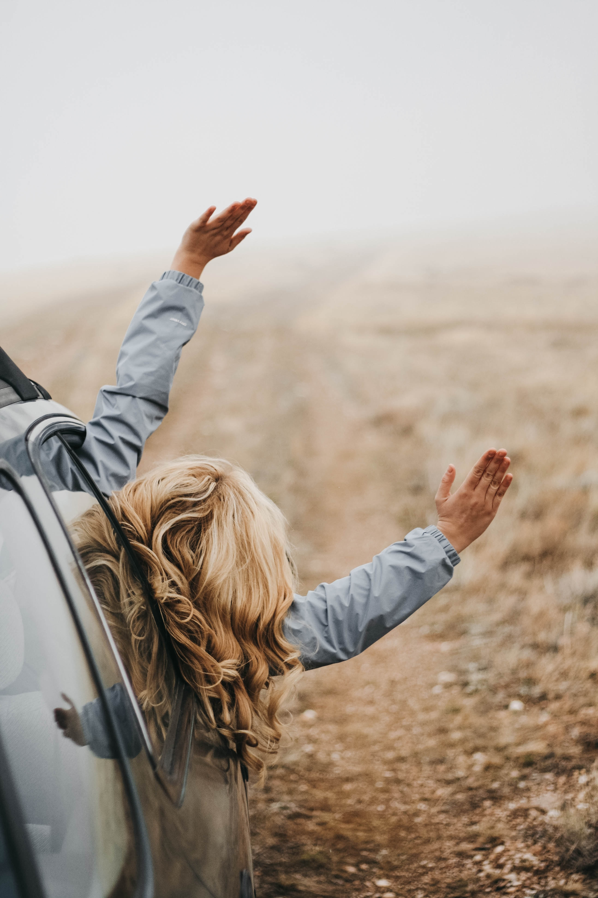

## A basic figure {#basic}

## Absolute {#absolute}

{.absolute top=0 right=0 height="100%"}

## Absolute, off the edge {#absolute-bleed}

{.absolute top="-10%" right="-10%" height="120%" style="max-height: unset;"}

## Absolute text {#absolute-text}

[python is great]{.absolute bottom="45%" left="20%"}

[and so is R]{.absolute bottom="0%" right="0%"}

## A background image {#background background-image="images/galen-crout.jpg"}

## {#background-text background-image="images/galen-crout.jpg"}

[always explore]{.absolute left="50%" top="20%" style="rotate: -10deg;"}

## {#overlay-plain background-image="images/tim-marshall.jpg"}

::: {.absolute left="55%" top="55%" style="font-size:1.8em;"}
Be Brave

Take Risks
:::

## {#overlay-box background-image="images/tim-marshall.jpg"}

::: {.absolute left="55%" top="55%" style="font-size:1.8em; padding: 0.5em 1em; background-color: rgba(255, 255, 255, .5);"}
Be Brave

Take Risks
:::

## {#overlay-glass background-image="images/tim-marshall.jpg"}

::: {.absolute left="55%" top="55%" style="font-size:1.8em; padding: 0.5em 1em; background-color: rgba(255, 255, 255, .5); backdrop-filter: blur(5px); box-shadow: 0 0 1rem 0 rgba(0, 0, 0, .5); border-radius: 5px;"}
Be Brave

Take Risks
:::
